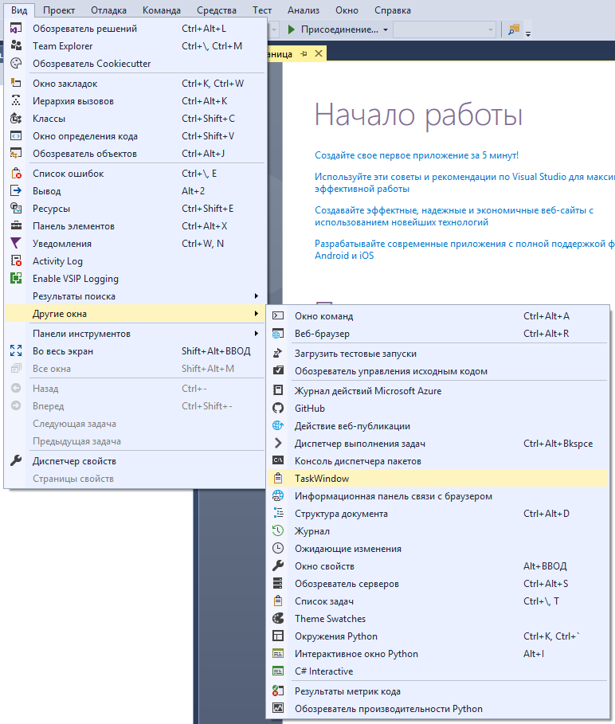
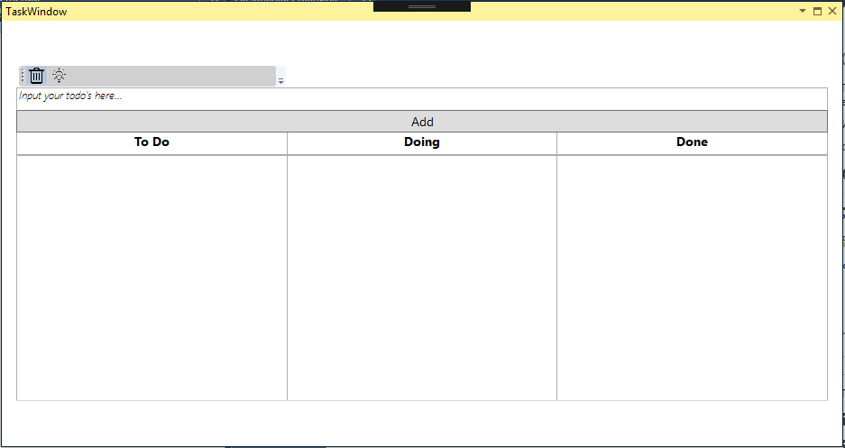

# InstantPlans

A simple extension to keep track of tasks in your current coding session.

## Getting Started

These instructions will get you a copy of the project up and running on your local machine for development and testing purposes. See deployment for notes on how to deploy the project on a live system.

### Prerequisites

You need to have Visual Studio 2010 or newer installed as this is a VSIX extension

```
- Visual Studio 2010 or newer installed

- Visual Studio SDK
```

### Installing

```
Install via Visual Studio Gallery.com (download and open directly or save then double-click)

You should be able to install it by double-clicking the .vsix file
```

or

```
Install it from within the Visual Studio Extension Manager (Tools->Extension Manger)
```
## Usage example

Open the extension through View Tab -> Other windows.





## Contributing

1. Fork it (<https://github.com/LetonGerman/InstantPlans/fork>)
2. Create your feature branch (`git checkout -b feature/somethingsomething`)
3. Commit your changes (`git commit -am 'Add some somethingsomething'`)
4. Push to the branch (`git push origin feature/somethingsomething`)
5. Create a new Pull Request

## Authors

* **German Leton** - *Initial work* - [PurpleBooth](https://github.com/LetonGerman)

See also the list of [contributors](https://github.com/LetonGerman/InstantPlans/contributors) who participated in this project.


## Acknowledgments

* Hat tip to anyone whose code was used
